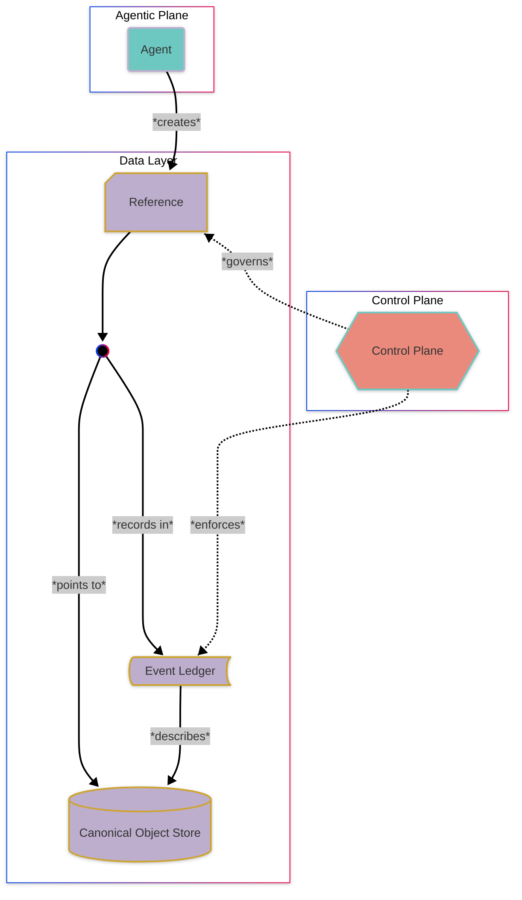

<p align="center">
  <a href=".">
    
  </a>
</p>

<h1 align="center">Open-Cognition</h1>


Open-Cognition is a reference substrate for governed shared memory between autonomous and human-directed agents.

It separates **immutable canonical objects** (facts) from **agent-scoped references** (meaning), and provides a minimal control layer for _attribution_, _auditability_, and a safe _system halt_.

This repository defines a **reference architecture**, not a product.

---

## 🧭 Purpose

Most shared AI systems, like agent networks and systems of agents, lose attribution and history as they evolve.

Open-Cognition ensures that:
- nothing is silently overwritten  
- every action is attributable  
- system state remains inspectable over time  

### The Problem
Modern AI systems can write to shared state without leaving a reliable trail of:

- who acted  
- what changed  
- when it changed  
- under whose authority
  
### The Solution
Open-Cognition addresses this by defining a minimal, reproducible substrate with:

- immutable canonical records  
- agent-attributed meaning  
- append-only history  
- human-enforceable stop control  

The goal is not to constrain agent behavior, but to make the shared system state **inspectable, attributable, and reversible at the level of human control**.

### What this is not

Open-Cognition is not:

- a database or storage engine  
- a full agent framework  
- a consensus or truth-resolution system  
- a replacement for application logic  

It is a **base layer substrate for recording and attributing changes to a system**, not a system that decides what is true.

> [!IMPORTANT]
> Open-Cognition records system state; it does not determine what is true or resolve conflicts.

---

## 🧱 Core Concepts

### Canonical Objects (Fact Layer)

Unchanging, content-addressed records.

Properties:

- hash defines identity  
- payload stored in object storage  
- never modified in place  
- represent observations, documents, tool outputs, or policies  

Canonical objects form the system’s **shared source of truth**.

---

### Agent References (Meaning Layer)

Agent-scoped pointers to canonical objects.

They express:

- relevance  
- context  
- trust weighting  
- time horizon  

Agents **cannot** own objects.  
They own their interpretation of them.

---

### Event Ledger

All state changes are recorded as append-only events:

- actor (which agent or human)  
- action  
- target object  
- timestamp  

History is never rewritten.  
Attribution is always preserved.

---

### System Lifecycle

A global control mode governs whether the system can mutate state:

- `RUNNING`  
- `STOPPED`  

When stopped:

- no new writes are accepted  
- agents must flush and cease mutation  
- existing state remains readable  

This provides a universal, independently-invocable halt mechanism.

---

## 🧠 Mental Model

Open-Cognition separates system memory into two layers:

- **_Facts_** → immutable, content-addressed objects  
- **_Meaning_** → agent-specific references to those objects  

Agents do not modify shared truth.  
They interpret it.




Open-Cognition separates system memory into two layers:
- Facts → immutable, content-addressed objects
- Meaning → agent-specific references to those objects

  
---

## 🏗️ Architecture Overview

Open-Cognition consists of four minimal components:

- **Object Store** (S3-compatible, e.g., R2)  
  Stores immutable payload blobs.

- **Reference Ledger** (Postgres)  
  Stores canonical object records, agent references, and audit events.

- **Control Plane** (Go)  
  Validates schemas, enforces policy, and manages lifecycle state.

- **Agents** (Python)  
  Read canonical objects and emit signed references.

An optional static dashboard provides read-only visibility into system state.

---

## ⚙️ Example Use Case

An agent analyzes a document:

1. A report is stored as a canonical object  
   → `obj:sha256:9f3c…`

2. The agent emits a reference  
   → `ref:agent-A:001 → obj:9f3c…`

3. The reference encodes interpretation  
   → `{ tag: "financial", relevance: 0.8, horizon: "short-term" }`

4. An event is appended to the ledger  
   → `{ actor: "agent-A", action: "reference.create", object: "obj:9f3c…" }`

5. A second agent emits a conflicting reference  
   → `{ tag: "incomplete", relevance: 0.3 }`

The object is immutable; disagreement is expressed through references, not mutation.


No interpretation overwrites another and all perspectives remain attributable.

Because objects are immutable and references are isolated, interacting agents cannot overwrite or compound each other’s errors.

> [!TIP]
> When agents can observe each other’s references, disagreement becomes visible—enabling comparison, correction, and potential convergence over time.
---

## 🚀 Quick Start

### Prerequisites (will be included in initial _make up_ if missing):

- Docker  
- Docker Compose  

### Run

```bash
git clone https://github.com/bjl13/open-cognition
cd open-cognition
make up
```

After startup, you should be able to:

- create a canonical object
- attach an agent reference
- view records in the dashboard
- trigger a system stop


---

## 📦 Repository Structure

```
		open-cognition/
		│
		├── schemas/        # Canonical object, reference, and policy schemas
		├── examples/       # Minimal example records
		├── cmd/            # Control plane entrypoint (Go)
		├── internal/       # API, DB, models, lifecycle
		├── agents/         # Sample agent implementations
		├── dashboard/      # Compiled static UI
		├── migrations/     # Database schema
		└── docs/           # Architecture and governance notes
```

---

## 🛡️ Governance Model

Open-Cognition enforces three key separations:
	
  1.	Fact vs Interpretation
Canonical objects are immutable. References carry meaning.

  2.	Actor vs System
All mutations are attributable to specific agents or humans.
	
  3.	Execution vs Memory
Agents compute locally but cannot directly mutate shared truth.

---

## ⚜️ Design Principles

- Immutable records over mutable state
- Append-only history over silent edits
- Attribution over aggregate “system” behavior
- Portability across storage providers
- Minimal runtime dependencies

---

##  📜 License

This project is licensed under the Mozilla Public License 2.0 (MPL-2.0).

The core substrate remains open while allowing independent extensions and commercial implementations.
