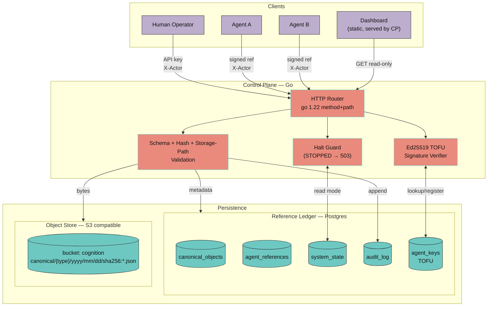

# Architecture Diagram

High-level component view. For the full text description, see
[`architecture.md`](architecture.md).

## Legend

- **Control Plane** is a single Go binary — one process, multiple
  responsibilities gated at the router level.
- **Reference Ledger** is the authoritative metadata store; five tables,
  all append-only by application convention.
- **Object Store** holds payload bytes under deterministic content-addressed
  paths. No overwrite is possible at the application layer.
- **Dashboard** is compiled TypeScript served directly by the control
  plane from `dashboard/static/` — no separate web server.

## Endpoint surface

| Endpoint | Method | Write? | Auth | Halt-gated |
|---|---|---|---|---|
| `/status` | GET | no | none | no |
| `/stop` | POST | yes | API key + X-Actor | no |
| `/resume` | POST | yes | API key + X-Actor | no |
| `/canonical` | POST | yes | API key + X-Actor | yes |
| `/reference` | POST | yes | API key + X-Actor + Ed25519 sig | yes |
| `/canonicals` | GET | no | none | no |
| `/references` | GET | no | none | no |
| `/audit` | GET | no | none | no |
| `/reconcile` | GET | no | none | no |
| `/` (dashboard) | GET | no | none | no |

API key enforcement is listed for completeness — the middleware ships with
the v1.0 freeze. Until then, network boundary is the auth boundary.
