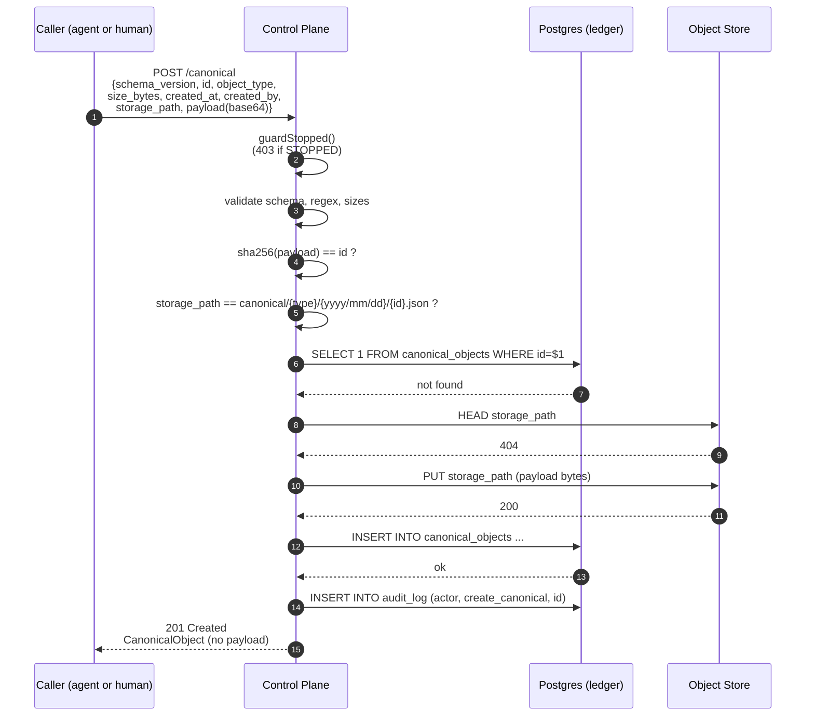
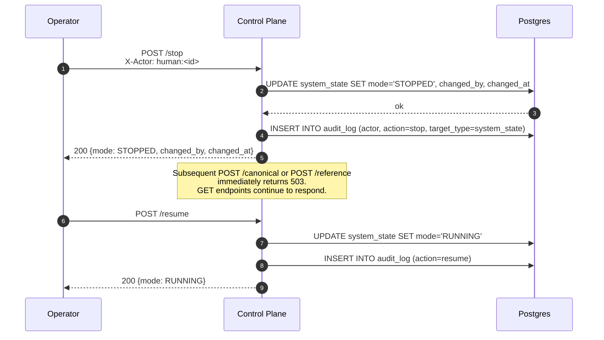
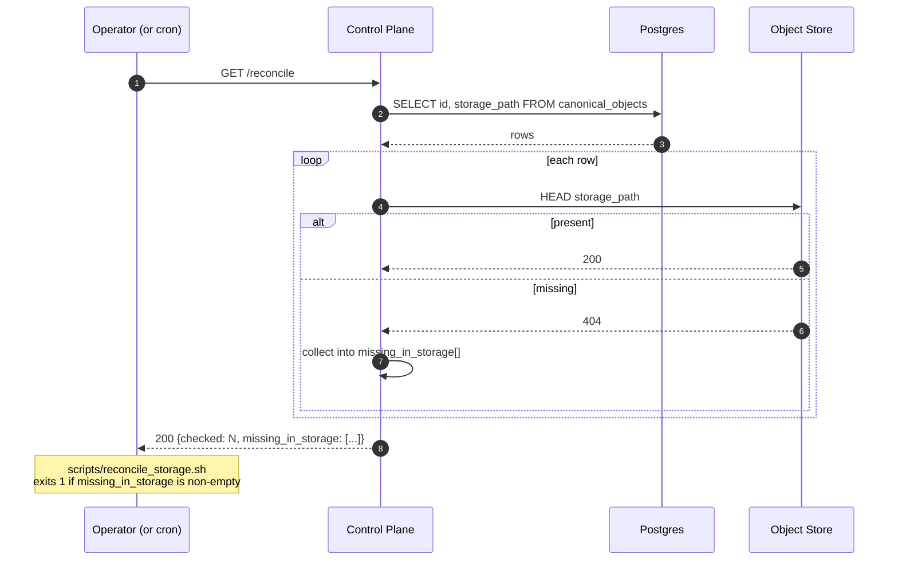
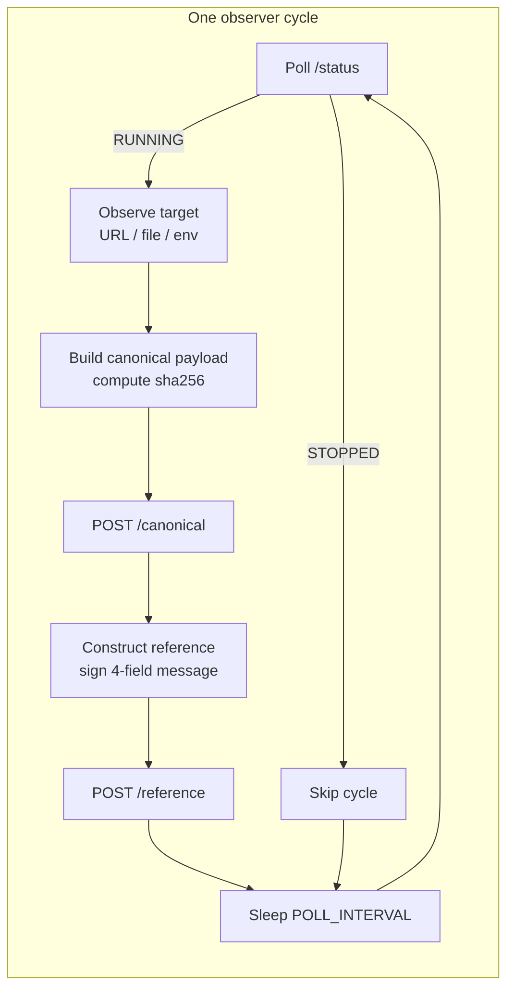

# Data Flow Diagrams

Four sequences cover every write path through the substrate. All reads are
straightforward (`SELECT` from Postgres, with the exception of `/reconcile`
which also HEAD-checks storage) and are not diagrammed.

---

## 1. Create a Canonical Object



**Failure branch**: if the PG insert fails *after* the S3 PUT, the object
is orphaned in storage. The next submission with the same hash hits the
409 in the HEAD check and surfaces an "inspect and reconcile manually"
error. `GET /reconcile` walks the ledger and reports storage mismatches.

---

## 2. Create an Agent Reference

```mermaid
sequenceDiagram
  autonumber
  participant A as Agent
  participant CP as Control Plane
  participant PG as Postgres (ledger)

  A->>A: sign({id}:{coid}:{agent_id}:{created_at})<br/>with Ed25519 private key
  A->>CP: POST /reference<br/>{ref fields, signature, public_key}
  CP->>CP: guardStopped()
  CP->>CP: validate schema (UUID v4, sha256:*, context required)
  CP->>PG: SELECT 1 FROM canonical_objects WHERE id=$1
  PG-->>CP: found
  CP->>CP: base64-decode sig + pubkey; verify Ed25519
  CP->>PG: SELECT public_key FROM agent_keys WHERE agent_id=$1
  alt new agent
    PG-->>CP: not found
    CP->>PG: INSERT agent_keys (agent_id, public_key, first_ref_id)<br/>TOFU registration
  else existing agent
    PG-->>CP: stored_key
    CP->>CP: submitted_key == stored_key ?<br/>(reject 422 if not)
  end
  CP->>PG: INSERT INTO agent_references ...
  CP->>PG: INSERT INTO audit_log (actor=agent_id, create_reference, ref_id)
  CP-->>A: 201 Created<br/>AgentReference
```

**Key property**: signature verification happens *before* the database
writes. A valid signature is a prerequisite for any row to exist.

---

## 3. System Halt



---

## 4. Reconciliation



The reverse direction (orphans in storage that are not in the ledger) is
caught by the HEAD check during `POST /canonical` rather than scanned by
`/reconcile`. This is asymmetric by design: the ledger is the source of
truth for what *should* exist.

---

## End-to-End: One Complete Agent Cycle



This is the loop in `agents/observer/`. It is the full happy-path write
surface exercised end-to-end in production.
